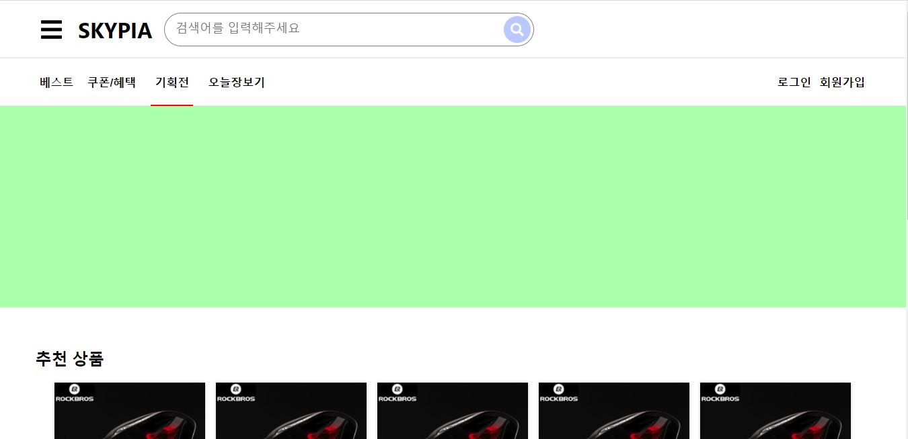
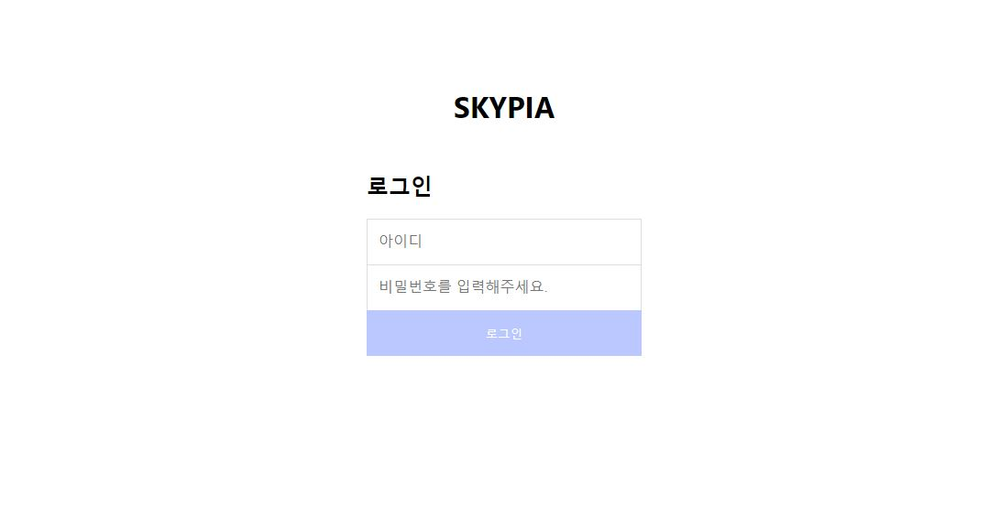
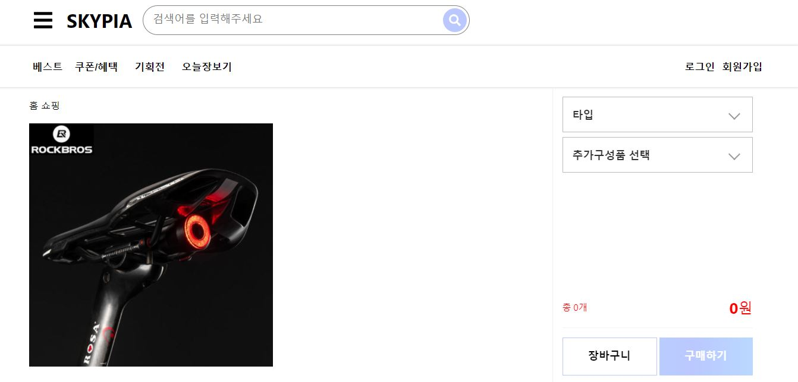
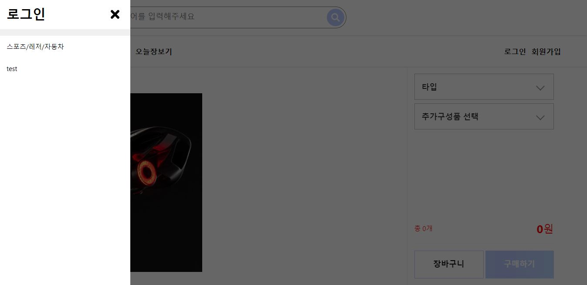

# Skypia

## Languages and Frameworks Used:

- [MongoDB](https://www.mongodb.com/)
- [Express.js](https://expressjs.com/)
- [React.js](https://reactjs.org/)
- [Redux.js](https://redux.js.org/)
- [Node.js](https://nodejs.org/en/)
- [GitHub](https://github.com/)
- [Heroku](https://www.heroku.com/)

---

## What is this?

쇼핑물 형태의 React.js + Express.js 기반 웹사이트 입니다.

---

### 실제 서비스 주소

- https://skypia.herokuapp.com/

---

### 주요기능

1.  회원가입, 로그인
2.  왼쪽 SideMenu bar
3.  상품 상세정보 페이지

### 사이트 화면 이미지

 - 메인 페이지

 - 로그인 페이지

 - 상품 설명 페이지

 - 사이드메뉴바
